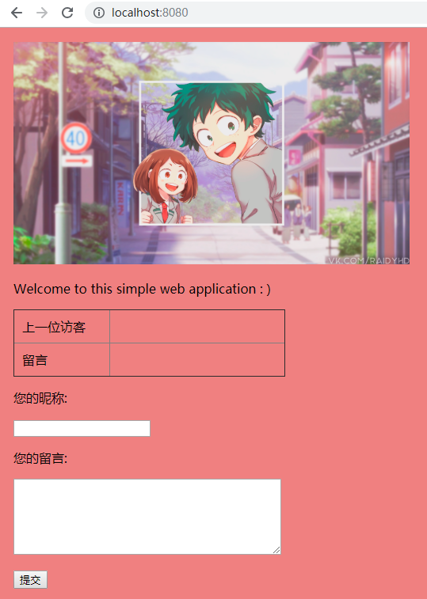
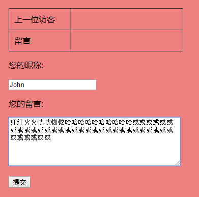
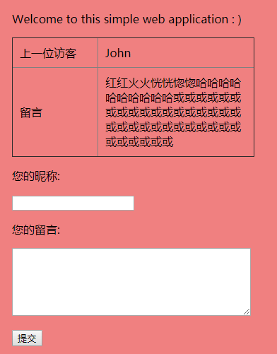
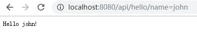
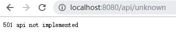

# SimpleWeb

## 代码解释

博客：[服务计算 | 简单web应用](https://yuyuforest.com/2018/11/15/golang-simple-web/)

## 运行结果

### 静态文件服务



### js访问

`assets/js/show.js`

```js
$(document).ready(function() {
    $.ajax({
        url: "/api/show"
    }).then(function(data) {
        if(data.nickname !== "") {
            $('#nickname').append(data.nickname);
            $('#message').append(data.message);
        }
    });
});
```

### 表单处理

提交表单前：



提交表单后：



### Not Implemented

实现的api：



未实现的api：



